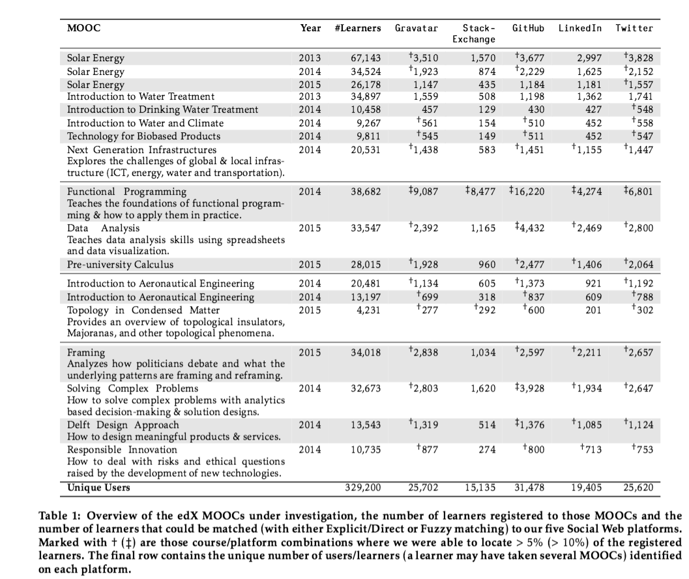

In the past years, we have been heavily relying on social media for research purposes (like many other research groups)
and by now it is very clear that we can learn *a lot* about people from the digital footprints they leave behind across the social Web.

Once we started looking at people that participate in MOOCs (i.e. the "learners") from a research perspective, we were
also curious to know where else on the Web they are active: on which social platforms do MOOC learners leave their
traces behind? The motivation for this question is not hard to find: learning things about our learners **before and/or after** they have taken a MOOC can enable us to, for instance, track the impact of the MOOC on people's lives, adapt MOOCs according to individual expertise before learners enter the MOOC platform and so forth.

In one of our recent papers (available at the [ACM Portal](http://dl.acm.org/citation.cfm?doid=2908131.2908145)): 

```bibtex
@inproceedings{Chen2016b,
  author = {Guanliang Chen and Dan Davis and Jun Lin and Claudia Hauff and Geert-Jan Houben},
  booktitle = {WebScience '16: 8th International ACM Web Science Conference},
  title = {Beyond the MOOC platform: Gaining Insights about Learners from the Social Web},
  pages = {15-24},
  year = {2016}
}
```  

we took a first step in that direction and investigated *where* we can find the more than
**320,000 learners** of **18 TU Delft MOOCs** (all running on [edX](https://www.edx.org/school/delftx)). The abstract:

> Massive Open Online Courses (MOOCs) have enabled millions of learners across the globe to 
> increase their levels of expertise in a wide variety of subjects. Research efforts surrounding 
> MOOCs are typically focused on improving the learning experience, as the current retention rates 
> (less than 7% of registered learners complete a MOOC) show a large gap between vision and reality 
> in MOOC learning.
> Current data-driven approaches to MOOC adaptations rely on data traces learners generate
> *within* a MOOC platform such as edX or Coursera. As a MOOC typically lasts between five and eight weeks 
> and with many MOOC learners being rather passive consumers of the learning material, this exclusive 
> use of MOOC platform data traces limits the insights that can be gained from them. 
>
> The Social Web potentially offers a rich source of data to *supplement* the MOOC platform data 
> traces, as many learners are also likely to be active on one or more Social Web platforms. 
> In this work, we present a first exploratory analysis of the Social Web platforms MOOC learners are 
> active on; we consider more than 320,000 learners that registered for 18 MOOCs on the edX platform and 
> explore their user profiles and activities on **StackExchange**, **GitHub**, **Twitter** and **LinkedIn**.

As we do not have unlimited resources, we considered only some of the most well-known social Web platforms.
Here is what we found:



Many of the MOOCs cover computer science or engineering subjects 
(we are after all the *Delft University of Technology*). The learners of the *Functional Programming* MOOC are 
most active on the social Web platforms we considered, with more than 40% of the learners being active on GitHub,
more than 20% being registered to StackExchange and more than 10% having Twitter and LinkedIn accounts.
The very opposite is true for the *Introduction to Water Treatment* MOOC: we could find less than 5% of learners on any of
the platforms under investigation. The platform we consistently (across all MOOCs) found most learners is 
Twitter: for 17 out of 18 MOOCs more than 5% of learners could be identified on Twitter.

Overall, these results are not very surprising (they make sense - which is good!). 
What was surprising to us was the type of learners that participate in particular MOOCs. As an example, consider
the [*Data Analysis*](https://www.edx.org/course/data-analysis-take-it-max-delftx-ex101x-0) MOOC, which teaches the
following:

> EX101x is for all of those struggling with data analysis. That crazy data collection from your boss? 
> Megabytes of sensor data to analyze? Looking for a smart way visualize your data in order to make sense out of it? 
> ...
> We will take a deep dive into data analysis with spreadsheets: PivotTables, VLOOKUPS, Named ranges, what-if analyses, 
> making great graphs - all those will be covered in the first weeks of the course. After that, we will investigate 
> the quality of the spreadsheet model, and especially how to make sure your spreadsheet remains error-free and robust.
>
> Finally, once we have mastered spreadsheets, we will demonstrate other ways to store and analyze data. We will also 
> look into how Python, a programming language, can help us with analyzing and manipulating data in spreadsheets.
>
> EX101x is created using Excel 2013 and Windows [...]

It teaches basic skills, that we had assumed "IT people" to know and have mastered already. But take a look at the type
of learners that took part in the MOOC:


This word cloud<sup>1</sup> shows you what job title (according to their LinkedIn profile) the learners of the *Data Analysis* MOOC have. Surprisingly,
many learners are self-proclaimed(?) *software engineers* and *project managers* who should possess the taught skills
already. Are these learners really learning or are they just in it for the certificate? And if they are only here for the
piece of paper in the end, are we reaching the right learners with our teaching?

<sub>
<sup>1</sup>Yes, we have read [Word clouds considered harmful](http://www.niemanlab.org/2011/10/word-clouds-considered-harmful/), and in cases like this one we think they are okay.
</sub>
