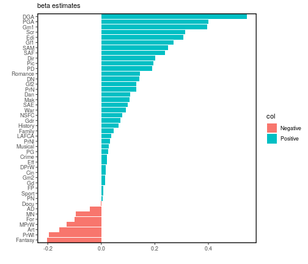

<style type="text/css">

body{ /* Normal  */
      font-size: 15px;
  }
td {  /* Table  */
  font-size: 14px;
}
h1.title {
  font-size: 20px;
  color: DarkRed;
}
h1 { /* Header 1 */
  font-size: 20px;
  color: DarkBlue;
}
h2 { /* Header 2 */
    font-size: 20px;
}
h3 { /* Header 3 */
  font-size: 20px;
  font-family: "Times New Roman", Times, serif;
}
code.r{ /* Code block */
    font-size: 15px;
}
pre { /* Code block - determines code spacing between lines */
    font-size: 15px;
}
</style>


## Oscars 2020 prediction

## Regularized Conditional logistic model 

To model the relationship between winning the Oscars (Y) and predictors (denoted, X), we sought to use a penalised conditional logistic regression model. Suppose we have  K independent competitions, each comprising of  nominees, the conditional likelihood per stratum ( k ) can be written as


where  is the set of collection of   sets  where . Consequently we can write the likelihood as 


### Regularization

In high-dimensional settings, penalized methods such as the **Lasso** could potentially reduce variance (to improve prediction accuracy) and to identify the subset of predictors that exhibit the strongest link with the response. We therefore recast our likelihood to include the  penalisation.


Our problem is now expressed as


where the parameter  is estimated using cross-validation. The model allows us to bound the coefficient such that   for a pre-specified parameter  t .  To model the probability of winning the oscar price, we first standardize our predictors.


#### Cross-validation



```
## optimal lambda value:
```

```
## [1] 2.132296
```


Next, we present the values of  corresponding to the best value of .


```
## estimated betas:
```


### Oscars 2020 predictions


```
## All Predictions for 2020 Oscars:
```


```
## Winners for 2020 Oscars:
```


The predicted winners are 


