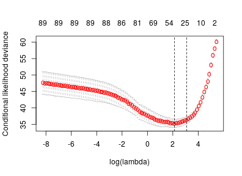
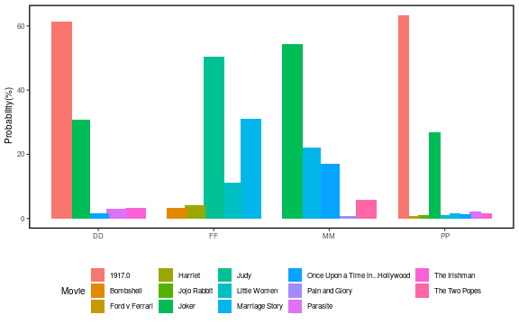
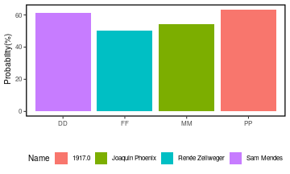

```r
ds=read.xlsx("https://docs.google.com/spreadsheets/d/1lAhFCtGGWJUoFXkXwLe7zyiXM8LRhM-TfgukYVtykuw/export?format=xlsx")

#fluoridation data
#str(ds)
#summary(ds)
#dim(ds)

# ch is the indicator or win or not, 1 is win, 2 is no win and 0 is NA
ds$win = 1*(ds$Ch==1)+ 0*(ds$Ch==2);
ds$win[ds$Ch==0] = NA;
#table(ds$win,useNA="always")

## DS:   reduced ds. .. best picture (PP)
## just the IMBD movie rating (Pardoe called it called WR)

alltest = ds[ds$win %in% 0:1 & !is.na(ds$WR),]

DS=ds[ds$win %in% 0:1 & ds$PP==1 & !is.na(ds$WR),
      c("Year","Name","PP","win","WR")]
#table(DS$win,DS$Year)

#DS[DS$Year==1928,] ## check !! 2 winners / 6. ? coding

# sort by Year (riskset). NB.  NB # Alway sort the riskset by the Year of production
# important because fitted values are sorted by this

DS=DS[order(DS$Year),]
# tail(DS,14)


fit = clogit(win ~ WR + strata(Year), data=DS) 
#fit
#str(fit)

DS$fittedLP = fit$linear.predictors ;
#tail(DS,14)

# check what linear predictors (LPs) really are
#tail(cbind(fit$coefficients * (DS$WR - fit$means),DS$fittedLP),20)

# fitted probabilities, riskset by riskset...
DS$exp.LP = exp(DS$fittedLP)
sums=aggregate(DS$exp.LP,by=list(Year=DS$Year),sum)
names(sums)[2] = "sum.exp.LP"
DS= merge(DS,sums,by="Year")
#length(DS[,1])
#tail(DS,14)

DS$fitted.prob.Win = DS$exp.LP/DS$sum.exp.LP # scale so add to 1
#tail(DS,14)

#check
#tail(aggregate(DS$fitted.prob.Win,by=list(Year=DS$Year),sum))
```


## Regularized Conditional logistic model 


To model the relationship between winning the Oscars (Y) and predictors (denoted, X), we sought to use a penalised conditional logistic regression model. Suppose we have $K$ independent competitions, each comprising of $n_k$ nominees, the conditional likelihood per stratum ($k$) can be written as

$$
\mathbb{P}(Y_{k1}=Y_{k2}= \dots=Y_{km_k}=1\big|\sum_{j=1}^{n_k} Y_{kj}={m_k})=\frac{\exp( \boldsymbol{\beta}^\top \sum_{j=1}^{m_k}X_{kj})}{\sum_{u\in \mathcal{S} _{m_k}^{n_k}}  \exp(\boldsymbol{\beta}^\top\sum_{j\in u} X_{kj})},
$$

where $\mathcal{S} _{m_k}^{n_k}$ is the set of collection of $^nC_m$ sets $\{i_1,...,i_m\}$ where $1\le i_1<...<i_m\le n$. Consequently we can write the likelihood as 
$$ L(\boldsymbol{\beta}) \  = \ \prod_{k=1}^{K} \frac{\exp( \boldsymbol{\beta}^\top \sum_{j=1}^{m_k}X_{kj})}{\sum_{u\in \mathcal{S} _{m_k}^{n_k}}  \exp(\boldsymbol{\beta}^\top\sum_{j\in u} X_{kj})}   $$


### Regularization

In high-dimensional settings, penalized methods such as the **Lasso** could potentially reduce variance (to improve prediction accuracy) and to identify the subset of predictors that exhibit the strongest link with the response. We therefore recast our likelihood to include the $L_1$ penalisation.


Our problem is now expressed as
$$ \hat{\boldsymbol{\beta}} \  = \ \arg\min_\beta\Big(
-\log\big(L(\boldsymbol{\beta},X)\big) + \lambda\|\boldsymbol{\beta}\|_1 \Big)  $$

where the parameter $\lambda$ is estimated using cross-validation. The model allows us to bound the coefficient such that $\sum_{j=1}^p|\beta_j|\le t$ for a pre-specified parameter $t$.  To model the probability of winning the oscar price, we first standardize our predictors.


```r
#clogitL1-c(1,3,9)

#alltest = alltest[order(alltest$Year),]
alltest = alltest[order(alltest$Comp),]

#colnames(alltest)
Year = strata.1 = alltest$Year
strata.2 = alltest$Comp  #alltest$Year
ID = alltest[,c(4,10)]   #Name and Movie
X = alltest[,c(5:8,11:100)]
y = alltest$win
#head(testdata)

# Return the column names containing missing observations
list_na <- colnames(X)[ apply(X, 2, anyNA) ]
#list_na

# create the median
# Create mean
median_missing <- apply(X[,colnames(X) %in% list_na],2,median, na.rm =  TRUE)
#median_missing

# Quick code to replace missing values with the mean
df_X <-data.frame(sapply(X,
        function(x) ifelse(is.na(x),
            median(x, na.rm = TRUE),
            x)))

# Normalize the X values
Xval = scale(as.matrix(df_X)[,-c(1:4)],center = T,scale = T)
yval = as.vector(y)

#fitLasso <- clogitLasso(Xval[,1:10],yval,strata.2,log=TRUE)

# fit the conditional logistic model
clObj = clogitL1(y=yval, x=Xval, strata = strata.2)
#plot(clObj, logX=T)
#clObj$alpha
```

#### Cross-validation


```r
# cross validation
clcvObj = cv.clogitL1(clObj)
plot(clcvObj)
```



```r
cat("minimum lambda value: \n")
```

```
## minimum lambda value:
```

```r
clcvObj$minCV_lambda
```

```
## [1] 2.132296
```

Next, we present the values of better corresponding to the best value of $\lambda$.


```r
#dim(clcvObj$cv_dev)
#clcvObj$lambda
#length(clcvObj$folds)
#cat("best cv lambda")
#clcvObj$minCV_lambda
index = which(clcvObj$lambda==clcvObj$minCV_lambda)
cat("estimated betas: \n")
```

```
## estimated betas:
```

```r
best.betas = clcvObj$beta[index,]

dat = data.frame(beta = best.betas, predictor = colnames(Xval))
dat$predictor<-as.factor(dat$predictor)
dat$col<-as.factor(ifelse(dat$beta>0,"Positive","Negative"))


ggplot(data=dat[dat$beta!=0,], aes(x=reorder(predictor, beta, FUN=function(x){return(x)}), 
                     y=beta, fill=col))+ geom_bar(stat="identity") +
  labs(subtitle="beta estimates") + ylab("") + xlab("") +
  coord_flip() + ljtheme #+theme_bw()
```


```r
# 
```


```r
fittedLP <- Xval %*% best.betas

exp.LP = exp(fittedLP)
fitsvals<-data.frame(Year,ID,ExpLP = exp.LP,Category=strata.2,Winner=yval)

sums=aggregate(fitsvals$ExpLP,by=list(Category=fitsvals$Category),sum)
names(sums)[2] = "sum.exp.LP"
allfits= merge(fitsvals,sums,by="Category")

allfits$fitted.prob.Win = allfits$ExpLP/allfits$sum.exp.LP #
merge_dat = allfits[,-c(5,7)]

colnames(merge_dat)[6]<-c("Predictions")

group = merge_dat

results <-group %>%
     group_by(Category) %>%
     slice(which.max(Predictions))

# cat("Prediction Accuracy: \n")
# paste(round((table(results$Winner)/length(results$Winner))[2]*100,2),"%",sep = "")
```


### Oscars 2020 predictions


```r
newdata = ds[ds$Year==2019,]

newstrata.1 = newdata$Year      #
newstrata.2 = newdata$Comp      #
newID = newdata[,c(4,10)]       #
newX = newdata[,c(5:8,11:100)]
newy = newdata$win

# fix the index
newstrata.2[which(newX$PP==1)]<-"PP"
newstrata.2[which(newX$DD==1)]<-"DD"
newstrata.2[which(newX$MM==1)]<-"MM"
newstrata.2[which(newX$FF==1)]<-"FF"

newdf_X <-data.frame(sapply(newX,
        function(x) ifelse(is.na(x),
            median(x, na.rm = TRUE),
            x)))

# scale the x values
newXval = scale(as.matrix(newdf_X)[,-c(1:4)],center = T,scale = T)
list_nan <- colnames(newXval)[ apply(newXval, 2, anyNA) ]
newXval[,list_nan]<-0

newyval = as.vector(newy) # rename the y value

# the predictions
newfittedLP <- newXval %*% best.betas

newexp.LP = exp(newfittedLP)
newfitsvals<-data.frame(newID, newExpLP = newexp.LP,Category=newstrata.2)


newsums=aggregate(newfitsvals$newExpLP,by=list(Category=newfitsvals$Category),sum)
names(newsums)[2] = "newsum.exp.LP"
newallfits= merge(newfitsvals,newsums,by="Category")

# Add the value of the predictor here

newallfits$fitted.prob.Win = newallfits$newExpLP/newallfits$newsum.exp.LP # scale so add to 1
group = newallfits[,c(1:3,6)]

colnames(group)<-c("Category","Name","Movie","Predictions")
group$Predictions<-round(group$Predictions,4)*100

cat("All Predictions for 2020 Oscars: \n")
```

```
## All Predictions for 2020 Oscars:
```

```r
DT::datatable(group)
```

```
## Error in file(con, "rb"): cannot open the connection
```

```r
g <- ggplot(group, aes(x = Category, y = Predictions, label=Name))
g + geom_bar(stat="identity", aes(fill=Movie),position = position_dodge(0.8), size = 0.7) + 
  # geom_text(aes(label=Name), vjust=-1.5, size = 2.2) +
  xlab("") + ylab(" Probability(%)") +
  ljtheme +
  theme(legend.position="bottom",text = element_text(size =10))
```



```r
results <-group %>%
     group_by(Category) %>%
     slice(which.max(Predictions))
# Print the winners for oscar 2020
cat("Winners for 2020 Oscars: \n")
```

```
## Winners for 2020 Oscars:
```

```r
DT::datatable(results)
```

```
## Error in file(con, "rb"): cannot open the connection
```

The predicted winners are 

```r
g <- ggplot(results, aes(x = Category, y = Predictions, label=Name))
g + geom_bar(stat="identity", aes(fill=Name),position = position_dodge(0.8), size = 0.7) + 
  xlab("") + ylab(" Probability(%)") +
  ljtheme +
  theme(legend.position="bottom",text = element_text(size =10))
```




